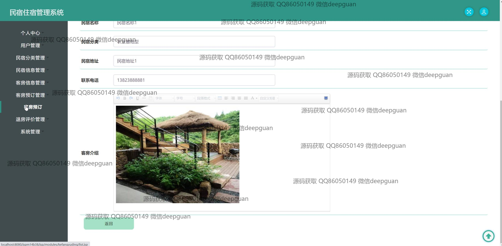
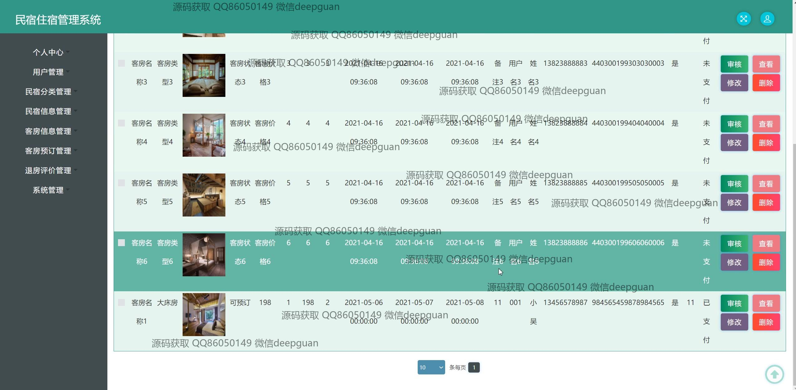

<h1 align="center">民宿住宿管理系统</h1>

## 简介
民宿住宿管理系统：角色分为管理员、用户；提供客房信息管理、用户预订、订单管理、个人中心、在线客服等功能，提升管理效率和用户体验。    --计算机毕业设计源码；毕设源码；java毕业设计源码

## 联系方式

<h3 align="center">获取完整代码与数据库文件 + 微信：deepguan QQ: 86050149 QQ群: 783742310</h3>

<h3 align="center">可帮忙远程部署 包运行成功！提供远程部署、修改代码、设计文档指导、代码讲解等服务！</h3>

## 功能介绍（完整见运行截图）
管理员：管理员可以通过后台管理系统执行用户管理、民宿分类管理、客房信息管理、客房预订管理、退房评价管理及系统管理等任务。可以进行新闻资讯的添加、查询、批量删除，通过筛选条件查询民宿信息，查看、修改或删除信息。还有权限审核和处理用户预订信息，更新房间状态，提高整体系统的管理效率。

用户：用户有权限注册、登录和退出管理系统。可以在网站首页浏览导航、查看民宿信息、客房信息，并进行预订操作。用户个人中心提供查看与修改个人信息、订单查询以及重置密码等功能。通过系统查找可用房间，查看详细信息如价格和设施，并进行在线预订。

客服：客服模块提供即时通信支持，通过在线状态图标确认客服可用性。用户可以发送消息请求帮助，通过表情或文字增强沟通体验。此功能旨在提高用户体验和满意度，帮助用户快速解决问题。

房客：房客可以浏览房源信息，查看客房图片和设施详情，进行预订管理及退房评价。用户界面允许上传文件、输入详细评价及评分，管理收藏。预订成功后可查看入住、退房时间及订单详情，便于用户安排旅行计划并反馈住宿体验。

## 运行截图

本代码来源于网络,仅供学习参考使用!

